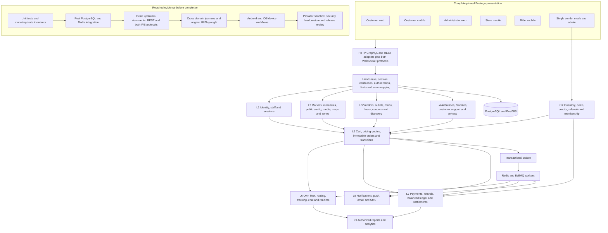

# Fair end to end implementation and local AI handoff

The main application is `/Users/premkumarmamidi/Development/Fair`, with runnable backend code in `implementation/`. The user authorized a local AI development handoff on 2026-10-08; that authorization supersedes the earlier local AI prohibition. Preserve the original Enatega UI, existing business invariants and independent review requirements. The complete product remains in progress.

## Frontend boundary

> The product UI MUST be the complete pinned Enatega frontend in `implementation/vendor/enatega-ui/`. FairBite owns the backend and integration layer only. Do not create, redesign, simplify or replace Enatega layouts, navigation, screens, components, styling, assets or interaction flows. Allowed frontend changes are limited to transport/adapters, secure session handling, validated data mapping, configuration and centralized display-name imports. Every edit inside `implementation/vendor/enatega-ui/` must be recorded in the root `SOURCE_PROVENANCE.json` under `allowedModifications`, and `node tools/manifest-enatega-ui.mjs` must be re-run so `SOURCE_MANIFEST.json` matches. An unsupported backend capability is an integration blocker: return a `NOT_IMPLEMENTED` error, never fake success, never fabricate data, never call the upstream Enatega production backend.

## System and implementation flow



## Exhaustive scope and traceability

`OPERATION_LANES.json` assigns 334 statically extracted GraphQL roots: 264 multivendor and 70 single-vendor. `ENATEGA_COMPATIBILITY_REPORT.json` currently records 846 document sites, 132 unresolved sites and 328 missing roots. These counts describe the current artifacts; regenerate and reconcile them after edits. The 334-root list is not an exhaustive runtime feature inventory.

`ACTION_CANDIDATES.json` contains 3,405 handler candidates across 1,095 files. Map every candidate to a source screen, user-visible action, business requirement and acceptance workflow. Inspect navigation, gestures, menus, spread props, dynamic components and native actions manually. A handler candidate is neither a distinct feature nor proof of runtime reachability.

For each action maintain: source file and line; source hash; role and tenant; product mode; operation/document or REST/subscription/native capability; lane; contract and persistence; positive tests; authorization/ownership/validation/concurrency/outage negatives; executed command, artifact and result; independent reviewer. Resolve all 132 dynamic/imported/interpolated sites with concrete source evidence. Account for routes with no GraphQL call, including maps, media, payment redirects/callbacks, notifications, offline handling, deep links, live activity, permissions and background location.

`OPERATION_TEST_EVIDENCE.json` provides one unverified record for every current static root. Populate its test arrays only from actual runs. `pnpm check:operations` fails until every operation has inspectable passing unit/integration evidence and applicable browser/native evidence. It validates declarations and files; independent review must verify that the referenced tests actually exercise the named operation and that the artifacts match this commit. It does not establish release readiness or resolve dynamic documents automatically.

## Business capabilities that must remain in scope

| Capability             | Required implementation and acceptance                                                                                                                                      |
| ---------------------- | --------------------------------------------------------------------------------------------------------------------------------------------------------------------------- |
| Identity               | Customer registration/login, all original role logins, rotation/revocation, recovery, OTP/social, staff provisioning, MFA and tenant capabilities                           |
| Merchant and catalog   | Vendor/outlet onboarding, scoped staff CRUD, publication, categories/foods/variations/addons, hours/timezones, images, prices and availability                              |
| Discovery              | Search, categories, serviceability, maps, addresses, favorites and pagination                                                                                               |
| Commerce               | Server cart, validated options, integer quotes, tax/fee/tip policy versions, idempotent placement, immutable snapshots and history                                          |
| Fulfillment            | Merchant accept/reject/preparation/handover, pickup and delivery transitions, timeout race handling                                                                         |
| Delivery               | Own fleets first; multiple configured fleets/providers, assignment/claim/availability, location, tracking, signed provider callbacks, Lalamove adapter and fallback routing |
| Finance                | Provider checkout and signed webhook events, idempotent capture/refund, balanced immutable ledger, zero core food commission, withdrawals and settlements                   |
| Communications         | Authorized chat, realtime events, push/email/SMS, token lifecycle, retries, dead letters and provider outage handling                                                       |
| Customer lifecycle     | History/reorder, ratings, support/disputes, export/deletion/retention and retained financial records                                                                        |
| Promotions             | Coupons, deals, memberships, credits and referrals; policy-approved economics, redemption concurrency and ledger postings                                                   |
| Administration         | Explicit capabilities, users/staff/outlets/riders/zones/configuration, audit records, reports and analytics                                                                 |
| Configuration          | Versioned markets/currencies/fleets/payment/tax/refund rules; Malaysia/MYR/own fleet are initial values, never permanent hard-coded restrictions                            |
| Native                 | Complete mobile screens, permissions, signed builds, background tracking/push/deep links/live activity and offline/reconnection paths                                       |
| Operations and release | Logging/redaction, readiness, alerts, dependency audit, load/concurrency/outage, backup restoration, deployment and owner release review                                    |

Retain all 18 workflow groups and FB00–FB20 gates in `END_TO_END_ACCEPTANCE.json` and `EXECUTION_PLAN.json`. The newer L0–L12 lanes organize ownership; they do not remove any older business capability. Single-vendor is included in the handoff backlog; its activation remains subject to the mode decision already recorded in the master plan. Unapproved economic/provider choices stay blocked rather than silently using draft defaults as production policy.

## Execution order

1. Preserve current work: inspect `git status` and never overwrite uncommitted kernel or other session changes. Read root and implementation AGENTS, source provenance, master decisions and this handoff.
2. Finish Wave 0 transport integration: wire the existing kernel into `app.ts`, public handshake and auth context, both WS protocols, Redis pubsub, body/complexity limits and safe errors. Existing untracked files are work in progress, not implemented gates.
3. Finish dynamic document reconciliation, exact schema contracts and data-model/ports in Wave 1. Apply migrations on an empty database and a populated migration-005 upgrade baseline. Preserve existing identity/catalog/address/configuration data. Passing SDL validation alone is insufficient.
4. Execute L1–L4 plans, then orders, dispatch, finance, communications and analytics in dependency order. Existing L5–L8 and Wave5 plans are explicitly PARTIAL; complete and review them before their implementation starts. Check all operation lists against the machine-readable inventory.
5. Execute `20-wave3-journeys-and-e2e.md` using the original customer/admin UI and replay mobile documents against the same real backend. Integrate source transport/configuration only and record every vendor edit in provenance.
6. Run native/device and provider sandbox acceptance, then hardening/release. Continue independent work while awaiting external inputs. Keep remaining inputs and failing gates visible.

The older plan references optional superpowers skills unavailable in this session. Its task and ownership instructions remain readable; do not claim those skills were invoked. Local AI may execute these tasks sequentially if it cannot run agents; use a separate reviewer for acceptance.

## Test commands and coverage

Use Node 24 and `./tools/pnpm.sh` from `implementation/`. Installation uses the existing store; if pnpm reports a store mismatch, match its recorded store instead of deleting modules or lockfiles. On this Mac Testcontainers needs both:

```sh
export DOCKER_HOST=unix:///Users/premkumarmamidi/.colima/default/docker.sock
export TESTCONTAINERS_DOCKER_SOCKET_OVERRIDE=/var/run/docker.sock
./tools/pnpm.sh test
./tools/pnpm.sh test:integration
./tools/pnpm.sh coverage:report
./tools/pnpm.sh coverage
./tools/pnpm.sh test:operation-evidence
./tools/pnpm.sh check:operations
./tools/pnpm.sh e2e:backend
./tools/pnpm.sh lint
./tools/pnpm.sh typecheck
./tools/pnpm.sh build
./tools/pnpm.sh codegen:check
./tools/pnpm.sh check:enatega-ui-source
./tools/pnpm.sh check:enatega
```

`coverage:report` measures API unit/HTTP tests and writes `coverage/api-unit`. `coverage` runs unit and real database/Redis integration tests together and writes `coverage/api-full`, enforcing 90% lines/functions and 85% branches for every authored API file. Generated Prisma source is excluded. Per-lane thresholds, worker coverage and API coverage under original UI E2E still need their own gates; the master requires at least 80% API lines under E2E.

`e2e:backend` builds the real API, starts an isolated server on 4199 with deliberately unavailable dependencies, and runs four Playwright boundary checks including Chromium navigation. It verifies liveness/readiness separation, truthful unavailable status, rejection of an unknown checkout document, malformed requests and origin restrictions. It does not test original UI, customer checkout, provider success, native behavior or real-stack journeys. Product `e2e`, `e2e:smoke` and `test:journeys` remain required work; do not alias them to this backend smoke suite.

## Completion rule

Finish only when every accepted screen/action and operation has implementation plus actual positive and negative evidence; original Enatega web journeys pass; native workflows pass on devices; configured providers pass sandbox verification; coverage and lint/typecheck/build pass; migrations/restore/load/security gates pass; independent reviews are closed. Missing credentials, device/signing setup and policy inputs are explicit blockers. Historical shell screenshots/tests, fabricated success, static inventory counts, HTTP 200 and Expo exports cannot close these gates.

## Verification checkpoint on 8 October 2026

The combined real-stack API run passed 133 tests across 19 files. It failed the coverage gate with 87.68% lines, 79.82% branches and 88.01% functions; per-file deficits are recorded in `test-results/full-coverage.log` and `coverage/api-full/index.html`. An earlier combined run had one socket hang-up; the isolated 14-test identity suite and subsequent complete 133-test run passed. This rerun does not erase the original failure record.

The backend Playwright suite passed all four checks. The latest default test run passed 94 API unit/HTTP tests, four worker tests, four identity-contract tests and 27 tooling tests; the subsequently added schema-composition regression passed separately. Lint, typecheck, four-package build, codegen comparison and the 4,137-file original UI manifest check passed. The final tooling suite includes 28 tests.

Kernel SDL root declarations now extend existing Query/Mutation roots; the new schema regression validates composition. The compatibility check returns FAIL with 846 document sites, 16 statically valid documents, 132 unresolved sites and 328 missing roots. Static kernel extraction still does not prove that `app.ts` uses the new transport/limit code or that codegen includes nested Enatega contracts; confirm both in Wave 0/1.

All 334 operation evidence entries remain NOT_VERIFIED. Passing backend tests establish bounded current behavior, not acceptance of every upstream operation. Original UI journeys, complete commerce/delivery/finance integration, native/device/provider verification and full release readiness remain open. Independent review accepted the scope mapping and checker safeguards; it did not approve product completion.
