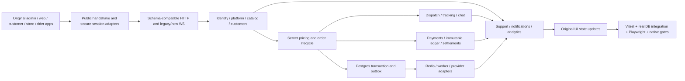

# Wave 3 — Cross-lane journeys, Playwright and coverage

**Goal:** Prove the original pinned apps operate against the real Fair API through complete user journeys, including failures and isolation. This plan defines required work, not completed tests. All per-lane G2 gates precede G3; providers, security and native-device release gates remain Wave 4 requirements.

## Frontend boundary

> The product UI MUST be the complete pinned Enatega frontend in `implementation/vendor/enatega-ui/`. FairBite owns the backend and integration layer only. Do not create, redesign, simplify or replace Enatega layouts, navigation, screens, components, styling, assets or interaction flows. Allowed frontend changes are limited to transport/adapters, secure session handling, validated data mapping, configuration and centralized display-name imports. Every edit inside `implementation/vendor/enatega-ui/` must be recorded in the root `SOURCE_PROVENANCE.json` under `allowedModifications`, and `node tools/manifest-enatega-ui.mjs` must be re-run so `SOURCE_MANIFEST.json` matches. An unsupported backend capability is an integration blocker: return a `NOT_IMPLEMENTED` error, never fake success, never fabricate data, never call the upstream Enatega production backend.

## End-to-end implementation and verification graph

## Files and ownership

L10 creates `e2e/playwright.config.ts`, `e2e/fixtures/session.ts`, `e2e/fixtures/network-audit.ts`, `e2e/fixtures/database.ts`, `e2e/specs/admin/*.spec.ts`, `e2e/specs/web/*.spec.ts`, and `services/api/test/journeys/*.spec.ts`. Root scripts/tools/coverage aggregation belong to lead. Backend failures return to the owning lane; no E2E worker rewrites a lane's domain logic. Only allowed transport/session/configuration mapping edits in `vendor/enatega-ui/**`, recorded in root provenance and source manifest, are permitted. Independent L11 QA verifies evidence and L13 security reviews sensitive journeys.

## Harness tasks before writing journeys

- [ ] H1: create deterministic isolated test database/Redis and real API/worker setup using `startStack()`, `startApi(stack)` and factories. Assign run IDs and tenant IDs; parallel specs never share mutation-sensitive fixtures. Record migration version, source commit and random seed. Cleanup removes only run-owned fixtures.
- [ ] H2: launch the original admin/web applications using their installed tooling and adapter configuration. Verify the public handshake and both WS protocol connections before UI specs. Locale route prefixes derive from actual source routing; configured launch ports are captured in evidence.
- [ ] H3: network-audit fixture records every HTTP request, websocket endpoint and console/page error. Deny upstream Enatega domains, unexpected external SDK calls and secret-bearing client URLs. Allow explicit localhost test services and approved sandbox providers only; fail on attempted upstream contact even if blocked.
- [ ] H4: establish independent browser contexts for customer/admin/staff/vendor/restaurant. Authenticate through original UI for auth tests; reusable storageState contains isolated authorized session fixtures for domain tests. Prove expired/revoked sessions are rejected after refresh, logout or deactivation.
- [ ] H5: instrument the actual API process and worker for V8 coverage; flush coverage at process shutdown, map compiled output to source and merge with unit/integration coverage. Browser coverage cannot stand in for API coverage. Require API under-E2E lines ≥80%; retain branch reports for auth, pricing and finance.
- [ ] H6: implement tagged-operation evidence collector. Literal `@op:mutation.name`/query/subscription tags count only when the test ran successfully and the corresponding real network operation executed. Failure/skips cannot increment coverage. Imported fragments and dynamically assembled documents must be resolved before G1.

## Required journey suites

Every suite uses exact original documents, original screen interactions and assertions on persisted records and visible results. Browser specs resolve selectors by role/label/text from pinned components, recording source file:line. Do not guess labels, intercept GraphQL with canned success, use production fallback or create replacement UI. Each mutation journey includes denied role, foreign tenant, invalid input and concurrency/retry tests in API integration; browser tests cover user-visible recovery and isolation.

| Journey / files                                                                                          | Trigger and actions                                                                                                                                                                                 | Required evidence and failure cases                                                                                                                                                                                                            |
| -------------------------------------------------------------------------------------------------------- | --------------------------------------------------------------------------------------------------------------------------------------------------------------------------------------------------- | ---------------------------------------------------------------------------------------------------------------------------------------------------------------------------------------------------------------------------------------------- |
| J01 `web/identity.spec.ts`, `admin/identity.spec.ts`, `mobile-identity.spec.ts`                          | Public bootstrap; customer email/phone checks, OTP/signup/login/profile; ownerLogin→ownerSession; rider/restaurant login; staff CRUD; refresh/reset/logout/deactivation; consent/token registration | Correct role/principal, real verification proof, no OTP/client-flag bypass; refresh race/reuse revocation; wrong audience social token; missing provider explicit failure; denied staff permission and invalid session                         |
| J02 `admin/configuration.spec.ts`, `web/configuration.spec.ts`, `mobile-configuration.spec.ts`           | Save all configuration families, currency/delivery/verification toggles, versions, reference geo/shop types/cuisines/zones/tax/tips/banner CRUD, audit/activity, media/maps                         | Persistence after reload; public/private projection; activation/version conflict; valid polygon and reference constraints; malicious upload, unsupported MIME and unavailable provider                                                         |
| J03 `admin/catalog.spec.ts`, `web/discovery.spec.ts`, `mobile-catalog.spec.ts`                           | Vendor/restaurant onboarding; categories/subcategories/food/options/addons/coupons; duplicate/delete; bounds/timings/availability/business; nearby/popular/top-rated/recent/previews/reviews        | Server money mapping and ownership; source-compatible pagination/typenames; fresh clone IDs; immutable order references; hidden/inactive/out-of-stock filtering; geographic boundary; foreign restaurant rejected                              |
| J04 `web/customer-support.spec.ts`, `admin/customers-support.spec.ts`, `mobile-customer-support.spec.ts` | Address CRUD/bulk/select; favourites; customer/user lists, notes/status and order history; tickets/participants/messages/status                                                                     | Single selected address under race; bulk denial rolls back; favourite uniqueness; ticket ownership and state transition; timestamps; suspended session revoked; retention protects financial history                                           |
| J05 `web/checkout.spec.ts`, `admin/orders.spec.ts`, `mobile-orders.spec.ts`                              | Customer server checkout/calculation/coupon/order → merchant incoming WS, ring mute, accept/preparation → pickup or delivery → history/details/review                                               | Client price ignored; bigint totals/zero core commission; stock/coupon redemption race; exact no-delivery error; idempotent order; pickup transition; cancellation/timeouts; subscription scoped and persisted before delivery                 |
| J06 `admin/dispatch.spec.ts`, `web/tracking-chat.spec.ts`, `mobile-dispatch.spec.ts`                     | Rider onboarding/zone/availability/vehicle/license/schedule; accept/assign race; picked/delivered statuses; locations/tracking/chat; live activity                                                  | Exactly one assignment; authorized subscribers only; stale GPS rejected; chat participant isolation; location retention; customer cancel races; provider-independent route; mobile location permissions/device gate                            |
| J07 `admin/finance.spec.ts`, `web/payment.spec.ts`, `mobile-finance.spec.ts`                             | Payment intent/Stripe Connect/PayPal routes; success/failure/webhook; refund; merchant/rider wallets and withdrawal/settlement/commission                                                           | Signed webhook, replay/out-of-order handling; balanced immutable journals; no raw card/client secrets; zero core food commission; payout race; partial failures recover; unavailable provider fails explicitly; real sandbox evidence required |
| J08 `admin/notifications.spec.ts`, `web/notifications.spec.ts`, `mobile-notifications.spec.ts`           | Notification create/list/read/send; event push/email/SMS; preferences/device tokens; retry/dead-letter                                                                                              | Real persisted read state; tenant and audience isolation; no notification before transaction commit; worker crash/replay dedup; opt-out; provider errors observable; device delivery requires real credentials                                 |
| J09 `admin/analytics.spec.ts`, `mobile-analytics.spec.ts`                                                | All dashboard and reporting roots across dates/restaurants/riders/vendors                                                                                                                           | Fixture-derived exact totals, cancelled/refunded exclusions, timezone boundaries and bigint rounding; foreign tenant cannot infer amounts; no fabricated charts                                                                                |
| J10 `cross-lane-delivery.spec.ts`, `web/full-lifecycle.spec.ts`                                          | Configuration→catalog→signup/address→checkout/payment→merchant acceptance→rider assignment→tracking/chat→delivery→review→notification→wallet/report/support                                         | One correlated order ID and balanced financial trail; WS updates and UI views agree with DB; end-to-end failure injection and retry leaves consistent state                                                                                    |
| J11 `cross-lane-pickup-cancel-refund.spec.ts`                                                            | Pickup path; customer/merchant cancellation; auto-cancel timeout; failed provider/capture; authorized refund and settlement                                                                         | Valid transitions only, one compensation per event, no double debit/credit, timeout race safe, display exact original terminal state                                                                                                           |
| J12 `security-isolation.spec.ts`                                                                         | Repeat protected document set with missing/expired/revoked token, wrong role and foreign IDs; subscribe before/after revocation                                                                     | Correct error codes, no business writes/events/data leak, subscriptions terminate on revocation, no configuration/credential/client secret leak                                                                                                |

Mobile journeys replay customer/store/rider documents in original screen order via `mobileClient`. Browser/device simulation does not certify native push, deep links, secure storage, background location, Live Activity, payment SDK or accessibility. Those remain explicit Wave 4 device tests with platform/version/device evidence.

## Per-operation journey obligations

The following 264 current multivendor-scope roots each need an executed journey or browser tag. Scope follows lane, not app presence: a root assigned L12 remains Wave 5 even if a multivendor app contains a conditional document. Reconcile additions after unresolved sites are resolved; this table is the current static inventory, not proof every runtime feature is inventoried. Shared L1 ownerLogout is included because its lane is L1; document replay can cover it even where currently only single-vendor source calls it.

| Operation                                                      | Owner | Suite       | Execution requirement                                                                                                                         |
| -------------------------------------------------------------- | ----- | ----------- | --------------------------------------------------------------------------------------------------------------------------------------------- |
| `query.allOrders`                                              | L5    | J05/J10/J11 | `@op:query.allOrders`; real response + persisted/visible assertions + applicable rejection cases                                              |
| `query.allOrdersPaginated`                                     | L5    | J05/J10/J11 | `@op:query.allOrdersPaginated`; real response + persisted/visible assertions + applicable rejection cases                                     |
| `query.allOrdersWithoutPagination`                             | L5    | J05/J10/J11 | `@op:query.allOrdersWithoutPagination`; real response + persisted/visible assertions + applicable rejection cases                             |
| `query.appleAuthNonce`                                         | L1    | J01         | `@op:query.appleAuthNonce`; real response + persisted/visible assertions + applicable rejection cases                                         |
| `query.attachedCuisines`                                       | L3    | J03         | `@op:query.attachedCuisines`; real response + persisted/visible assertions + applicable rejection cases                                       |
| `query.auditLogs`                                              | L2    | J02         | `@op:query.auditLogs`; real response + persisted/visible assertions + applicable rejection cases                                              |
| `query.availableRiders`                                        | L6    | J06/J10     | `@op:query.availableRiders`; real response + persisted/visible assertions + applicable rejection cases                                        |
| `query.banners`                                                | L2    | J02         | `@op:query.banners`; real response + persisted/visible assertions + applicable rejection cases                                                |
| `query.chat`                                                   | L6    | J06/J10     | `@op:query.chat`; real response + persisted/visible assertions + applicable rejection cases                                                   |
| `query.commissionRate`                                         | L7    | J07/J10/J11 | `@op:query.commissionRate`; real response + persisted/visible assertions + applicable rejection cases                                         |
| `query.configuration`                                          | L2    | J02         | `@op:query.configuration`; real response + persisted/visible assertions + applicable rejection cases                                          |
| `query.coupons`                                                | L3    | J03         | `@op:query.coupons`; real response + persisted/visible assertions + applicable rejection cases                                                |
| `query.couponsPaginated`                                       | L3    | J03         | `@op:query.couponsPaginated`; real response + persisted/visible assertions + applicable rejection cases                                       |
| `query.cuisines`                                               | L2    | J02         | `@op:query.cuisines`; real response + persisted/visible assertions + applicable rejection cases                                               |
| `query.cuisinesPaginated`                                      | L2    | J02         | `@op:query.cuisinesPaginated`; real response + persisted/visible assertions + applicable rejection cases                                      |
| `query.earnings`                                               | L7    | J07/J10/J11 | `@op:query.earnings`; real response + persisted/visible assertions + applicable rejection cases                                               |
| `query.fetchAllShopTypes`                                      | L2    | J02         | `@op:query.fetchAllShopTypes`; real response + persisted/visible assertions + applicable rejection cases                                      |
| `query.fetchCategoryDetailsByStoreId`                          | L3    | J03         | `@op:query.fetchCategoryDetailsByStoreId`; real response + persisted/visible assertions + applicable rejection cases                          |
| `query.fetchCategoryDetailsByStoreIdForMobile`                 | L3    | J03         | `@op:query.fetchCategoryDetailsByStoreIdForMobile`; real response + persisted/visible assertions + applicable rejection cases                 |
| `query.fetchShopTypeByUnique`                                  | L2    | J02         | `@op:query.fetchShopTypeByUnique`; real response + persisted/visible assertions + applicable rejection cases                                  |
| `query.fetchShopTypes`                                         | L2    | J02         | `@op:query.fetchShopTypes`; real response + persisted/visible assertions + applicable rejection cases                                         |
| `query.getActiveOrders`                                        | L6    | J06/J10     | `@op:query.getActiveOrders`; real response + persisted/visible assertions + applicable rejection cases                                        |
| `query.getCitiesByCountry`                                     | L2    | J02         | `@op:query.getCitiesByCountry`; real response + persisted/visible assertions + applicable rejection cases                                     |
| `query.getClonedRestaurants`                                   | L3    | J03         | `@op:query.getClonedRestaurants`; real response + persisted/visible assertions + applicable rejection cases                                   |
| `query.getClonedRestaurantsPaginated`                          | L3    | J03         | `@op:query.getClonedRestaurantsPaginated`; real response + persisted/visible assertions + applicable rejection cases                          |
| `query.getCountries`                                           | L2    | J02         | `@op:query.getCountries`; real response + persisted/visible assertions + applicable rejection cases                                           |
| `query.getCountryByIso`                                        | L2    | J02         | `@op:query.getCountryByIso`; real response + persisted/visible assertions + applicable rejection cases                                        |
| `query.getDashboardOrdersByType`                               | L9    | J09/J10     | `@op:query.getDashboardOrdersByType`; real response + persisted/visible assertions + applicable rejection cases                               |
| `query.getDashboardSalesByType`                                | L9    | J09/J10     | `@op:query.getDashboardSalesByType`; real response + persisted/visible assertions + applicable rejection cases                                |
| `query.getDashboardUsers`                                      | L9    | J09/J10     | `@op:query.getDashboardUsers`; real response + persisted/visible assertions + applicable rejection cases                                      |
| `query.getDashboardUsersByYear`                                | L9    | J09/J10     | `@op:query.getDashboardUsersByYear`; real response + persisted/visible assertions + applicable rejection cases                                |
| `query.getLiveMonitorData`                                     | L6    | J06/J10     | `@op:query.getLiveMonitorData`; real response + persisted/visible assertions + applicable rejection cases                                     |
| `query.getRestaurantDashboardOrderSalesDetailsByPaymentMethod` | L9    | J09/J10     | `@op:query.getRestaurantDashboardOrderSalesDetailsByPaymentMethod`; real response + persisted/visible assertions + applicable rejection cases |
| `query.getRestaurantDashboardOrdersSalesStats`                 | L9    | J09/J10     | `@op:query.getRestaurantDashboardOrdersSalesStats`; real response + persisted/visible assertions + applicable rejection cases                 |
| `query.getRestaurantDashboardSalesOrderCountDetailsByYear`     | L9    | J09/J10     | `@op:query.getRestaurantDashboardSalesOrderCountDetailsByYear`; real response + persisted/visible assertions + applicable rejection cases     |
| `query.getRestaurantDeliveryZoneInfo`                          | L3    | J03         | `@op:query.getRestaurantDeliveryZoneInfo`; real response + persisted/visible assertions + applicable rejection cases                          |
| `query.getSingleSupportTicket`                                 | L4    | J04         | `@op:query.getSingleSupportTicket`; real response + persisted/visible assertions + applicable rejection cases                                 |
| `query.getSingleUserSupportTickets`                            | L4    | J04         | `@op:query.getSingleUserSupportTickets`; real response + persisted/visible assertions + applicable rejection cases                            |
| `query.getStoreDetailsByVendorId`                              | L3    | J03         | `@op:query.getStoreDetailsByVendorId`; real response + persisted/visible assertions + applicable rejection cases                              |
| `query.getStoreDetailsByVendorIdPaginated`                     | L3    | J03         | `@op:query.getStoreDetailsByVendorIdPaginated`; real response + persisted/visible assertions + applicable rejection cases                     |
| `query.getTicketMessages`                                      | L4    | J04         | `@op:query.getTicketMessages`; real response + persisted/visible assertions + applicable rejection cases                                      |
| `query.getTicketUsers`                                         | L4    | J04         | `@op:query.getTicketUsers`; real response + persisted/visible assertions + applicable rejection cases                                         |
| `query.getTicketUsersWithLatest`                               | L4    | J04         | `@op:query.getTicketUsersWithLatest`; real response + persisted/visible assertions + applicable rejection cases                               |
| `query.getUsersActiveOrders`                                   | L5    | J05/J10/J11 | `@op:query.getUsersActiveOrders`; real response + persisted/visible assertions + applicable rejection cases                                   |
| `query.getUsersPastOrders`                                     | L5    | J05/J10/J11 | `@op:query.getUsersPastOrders`; real response + persisted/visible assertions + applicable rejection cases                                     |
| `query.getVendor`                                              | L3    | J03         | `@op:query.getVendor`; real response + persisted/visible assertions + applicable rejection cases                                              |
| `query.getVendorDashboardGrowthDetailsByYear`                  | L9    | J09/J10     | `@op:query.getVendorDashboardGrowthDetailsByYear`; real response + persisted/visible assertions + applicable rejection cases                  |
| `query.getVendorDashboardStatsCardDetails`                     | L9    | J09/J10     | `@op:query.getVendorDashboardStatsCardDetails`; real response + persisted/visible assertions + applicable rejection cases                     |
| `query.getVersions`                                            | L2    | J02         | `@op:query.getVersions`; real response + persisted/visible assertions + applicable rejection cases                                            |
| `query.hasOwnerPermission`                                     | L1    | J01         | `@op:query.hasOwnerPermission`; real response + persisted/visible assertions + applicable rejection cases                                     |
| `query.mostOrderedRestaurants`                                 | L3    | J03         | `@op:query.mostOrderedRestaurants`; real response + persisted/visible assertions + applicable rejection cases                                 |
| `query.mostOrderedRestaurantsPreview`                          | L3    | J03         | `@op:query.mostOrderedRestaurantsPreview`; real response + persisted/visible assertions + applicable rejection cases                          |
| `query.nearByRestaurants`                                      | L3    | J03         | `@op:query.nearByRestaurants`; real response + persisted/visible assertions + applicable rejection cases                                      |
| `query.nearByRestaurantsCuisines`                              | L3    | J03         | `@op:query.nearByRestaurantsCuisines`; real response + persisted/visible assertions + applicable rejection cases                              |
| `query.nearByRestaurantsPreview`                               | L3    | J03         | `@op:query.nearByRestaurantsPreview`; real response + persisted/visible assertions + applicable rejection cases                               |
| `query.notifications`                                          | L8    | J08/J10     | `@op:query.notifications`; real response + persisted/visible assertions + applicable rejection cases                                          |
| `query.notificationsPaginated`                                 | L8    | J08/J10     | `@op:query.notificationsPaginated`; real response + persisted/visible assertions + applicable rejection cases                                 |
| `query.order`                                                  | L5    | J05/J10/J11 | `@op:query.order`; real response + persisted/visible assertions + applicable rejection cases                                                  |
| `query.orderDetails`                                           | L5    | J05/J10/J11 | `@op:query.orderDetails`; real response + persisted/visible assertions + applicable rejection cases                                           |
| `query.orderFilterOptions`                                     | L5    | J05/J10/J11 | `@op:query.orderFilterOptions`; real response + persisted/visible assertions + applicable rejection cases                                     |
| `query.orderTracking`                                          | L6    | J06/J10     | `@op:query.orderTracking`; real response + persisted/visible assertions + applicable rejection cases                                          |
| `query.orders`                                                 | L5    | J05/J10/J11 | `@op:query.orders`; real response + persisted/visible assertions + applicable rejection cases                                                 |
| `query.ordersByRestId`                                         | L5    | J05/J10/J11 | `@op:query.ordersByRestId`; real response + persisted/visible assertions + applicable rejection cases                                         |
| `query.ordersByRestIdWithoutPagination`                        | L5    | J05/J10/J11 | `@op:query.ordersByRestIdWithoutPagination`; real response + persisted/visible assertions + applicable rejection cases                        |
| `query.ordersByUser`                                           | L4    | J04         | `@op:query.ordersByUser`; real response + persisted/visible assertions + applicable rejection cases                                           |
| `query.ownerSession`                                           | L1    | J01         | `@op:query.ownerSession`; real response + persisted/visible assertions + applicable rejection cases                                           |
| `query.popularFoodItems`                                       | L3    | J03         | `@op:query.popularFoodItems`; real response + persisted/visible assertions + applicable rejection cases                                       |
| `query.popularItems`                                           | L3    | J03         | `@op:query.popularItems`; real response + persisted/visible assertions + applicable rejection cases                                           |
| `query.profile`                                                | L1    | J01         | `@op:query.profile`; real response + persisted/visible assertions + applicable rejection cases                                                |
| `query.publicConfiguration`                                    | L2    | J02         | `@op:query.publicConfiguration`; real response + persisted/visible assertions + applicable rejection cases                                    |
| `query.recentOrderRestaurants`                                 | L3    | J03         | `@op:query.recentOrderRestaurants`; real response + persisted/visible assertions + applicable rejection cases                                 |
| `query.recentOrderRestaurantsPreview`                          | L3    | J03         | `@op:query.recentOrderRestaurantsPreview`; real response + persisted/visible assertions + applicable rejection cases                          |
| `query.relatedItems`                                           | L3    | J03         | `@op:query.relatedItems`; real response + persisted/visible assertions + applicable rejection cases                                           |
| `query.restaurant`                                             | L3    | J03         | `@op:query.restaurant`; real response + persisted/visible assertions + applicable rejection cases                                             |
| `query.restaurantAddonsPaginated`                              | L3    | J03         | `@op:query.restaurantAddonsPaginated`; real response + persisted/visible assertions + applicable rejection cases                              |
| `query.restaurantByOwner`                                      | L3    | J03         | `@op:query.restaurantByOwner`; real response + persisted/visible assertions + applicable rejection cases                                      |
| `query.restaurantCategoriesPaginated`                          | L3    | J03         | `@op:query.restaurantCategoriesPaginated`; real response + persisted/visible assertions + applicable rejection cases                          |
| `query.restaurantCoupons`                                      | L3    | J03         | `@op:query.restaurantCoupons`; real response + persisted/visible assertions + applicable rejection cases                                      |
| `query.restaurantCouponsPaginated`                             | L3    | J03         | `@op:query.restaurantCouponsPaginated`; real response + persisted/visible assertions + applicable rejection cases                             |
| `query.restaurantOptionsPaginated`                             | L3    | J03         | `@op:query.restaurantOptionsPaginated`; real response + persisted/visible assertions + applicable rejection cases                             |
| `query.restaurantOrders`                                       | L5    | J05/J10/J11 | `@op:query.restaurantOrders`; real response + persisted/visible assertions + applicable rejection cases                                       |
| `query.restaurantReviewsPaginated`                             | L3    | J03         | `@op:query.restaurantReviewsPaginated`; real response + persisted/visible assertions + applicable rejection cases                             |
| `query.restaurants`                                            | L3    | J03         | `@op:query.restaurants`; real response + persisted/visible assertions + applicable rejection cases                                            |
| `query.restaurantsPaginated`                                   | L3    | J03         | `@op:query.restaurantsPaginated`; real response + persisted/visible assertions + applicable rejection cases                                   |
| `query.reviews`                                                | L3    | J03         | `@op:query.reviews`; real response + persisted/visible assertions + applicable rejection cases                                                |
| `query.reviewsByRestaurant`                                    | L3    | J03         | `@op:query.reviewsByRestaurant`; real response + persisted/visible assertions + applicable rejection cases                                    |
| `query.rider`                                                  | L6    | J06/J10     | `@op:query.rider`; real response + persisted/visible assertions + applicable rejection cases                                                  |
| `query.riderCurrentWithdrawRequest`                            | L7    | J07/J10/J11 | `@op:query.riderCurrentWithdrawRequest`; real response + persisted/visible assertions + applicable rejection cases                            |
| `query.riderEarningsGraph`                                     | L7    | J07/J10/J11 | `@op:query.riderEarningsGraph`; real response + persisted/visible assertions + applicable rejection cases                                     |
| `query.riderOrders`                                            | L6    | J06/J10     | `@op:query.riderOrders`; real response + persisted/visible assertions + applicable rejection cases                                            |
| `query.riders`                                                 | L6    | J06/J10     | `@op:query.riders`; real response + persisted/visible assertions + applicable rejection cases                                                 |
| `query.ridersByZone`                                           | L6    | J06/J10     | `@op:query.ridersByZone`; real response + persisted/visible assertions + applicable rejection cases                                           |
| `query.ridersPaginated`                                        | L6    | J06/J10     | `@op:query.ridersPaginated`; real response + persisted/visible assertions + applicable rejection cases                                        |
| `query.staffs`                                                 | L1    | J01         | `@op:query.staffs`; real response + persisted/visible assertions + applicable rejection cases                                                 |
| `query.staffsPaginated`                                        | L1    | J01         | `@op:query.staffsPaginated`; real response + persisted/visible assertions + applicable rejection cases                                        |
| `query.storeCurrentWithdrawRequest`                            | L7    | J07/J10/J11 | `@op:query.storeCurrentWithdrawRequest`; real response + persisted/visible assertions + applicable rejection cases                            |
| `query.storeEarningsGraph`                                     | L7    | J07/J10/J11 | `@op:query.storeEarningsGraph`; real response + persisted/visible assertions + applicable rejection cases                                     |
| `query.subCategories`                                          | L3    | J03         | `@op:query.subCategories`; real response + persisted/visible assertions + applicable rejection cases                                          |
| `query.subCategoriesByParentId`                                | L3    | J03         | `@op:query.subCategoriesByParentId`; real response + persisted/visible assertions + applicable rejection cases                                |
| `query.subCategory`                                            | L3    | J03         | `@op:query.subCategory`; real response + persisted/visible assertions + applicable rejection cases                                            |
| `query.taxes`                                                  | L2    | J02         | `@op:query.taxes`; real response + persisted/visible assertions + applicable rejection cases                                                  |
| `query.tips`                                                   | L2    | J02         | `@op:query.tips`; real response + persisted/visible assertions + applicable rejection cases                                                   |
| `query.topRatedVendors`                                        | L3    | J03         | `@op:query.topRatedVendors`; real response + persisted/visible assertions + applicable rejection cases                                        |
| `query.topRatedVendorsPreview`                                 | L3    | J03         | `@op:query.topRatedVendorsPreview`; real response + persisted/visible assertions + applicable rejection cases                                 |
| `query.transactionHistory`                                     | L7    | J07/J10/J11 | `@op:query.transactionHistory`; real response + persisted/visible assertions + applicable rejection cases                                     |
| `query.user`                                                   | L4    | J04         | `@op:query.user`; real response + persisted/visible assertions + applicable rejection cases                                                   |
| `query.userFavourite`                                          | L4    | J04         | `@op:query.userFavourite`; real response + persisted/visible assertions + applicable rejection cases                                          |
| `query.users`                                                  | L4    | J04         | `@op:query.users`; real response + persisted/visible assertions + applicable rejection cases                                                  |
| `query.usersPaginated`                                         | L4    | J04         | `@op:query.usersPaginated`; real response + persisted/visible assertions + applicable rejection cases                                         |
| `query.vendorCount`                                            | L3    | J03         | `@op:query.vendorCount`; real response + persisted/visible assertions + applicable rejection cases                                            |
| `query.vendors`                                                | L3    | J03         | `@op:query.vendors`; real response + persisted/visible assertions + applicable rejection cases                                                |
| `query.webNotifications`                                       | L8    | J08/J10     | `@op:query.webNotifications`; real response + persisted/visible assertions + applicable rejection cases                                       |
| `query.withdrawRequests`                                       | L7    | J07/J10/J11 | `@op:query.withdrawRequests`; real response + persisted/visible assertions + applicable rejection cases                                       |
| `query.zones`                                                  | L2    | J02         | `@op:query.zones`; real response + persisted/visible assertions + applicable rejection cases                                                  |
| `query.zonesPaginated`                                         | L2    | J02         | `@op:query.zonesPaginated`; real response + persisted/visible assertions + applicable rejection cases                                         |
| `mutation.Deactivate`                                          | L1    | J01         | `@op:mutation.Deactivate`; real response + persisted/visible assertions + applicable rejection cases                                          |
| `mutation.abortOrder`                                          | L5    | J05/J10/J11 | `@op:mutation.abortOrder`; real response + persisted/visible assertions + applicable rejection cases                                          |
| `mutation.acceptOrder`                                         | L5    | J05/J10/J11 | `@op:mutation.acceptOrder`; real response + persisted/visible assertions + applicable rejection cases                                         |
| `mutation.addFavourite`                                        | L4    | J04         | `@op:mutation.addFavourite`; real response + persisted/visible assertions + applicable rejection cases                                        |
| `mutation.assignOrder`                                         | L6    | J06/J10     | `@op:mutation.assignOrder`; real response + persisted/visible assertions + applicable rejection cases                                         |
| `mutation.assignRider`                                         | L6    | J06/J10     | `@op:mutation.assignRider`; real response + persisted/visible assertions + applicable rejection cases                                         |
| `mutation.cancelOrder`                                         | L5    | J05/J10/J11 | `@op:mutation.cancelOrder`; real response + persisted/visible assertions + applicable rejection cases                                         |
| `mutation.changePassword`                                      | L1    | J01         | `@op:mutation.changePassword`; real response + persisted/visible assertions + applicable rejection cases                                      |
| `mutation.coupon`                                              | L5    | J05/J10/J11 | `@op:mutation.coupon`; real response + persisted/visible assertions + applicable rejection cases                                              |
| `mutation.createActivity`                                      | L2    | J02         | `@op:mutation.createActivity`; real response + persisted/visible assertions + applicable rejection cases                                      |
| `mutation.createAddons`                                        | L3    | J03         | `@op:mutation.createAddons`; real response + persisted/visible assertions + applicable rejection cases                                        |
| `mutation.createAddress`                                       | L4    | J04         | `@op:mutation.createAddress`; real response + persisted/visible assertions + applicable rejection cases                                       |
| `mutation.createBanner`                                        | L2    | J02         | `@op:mutation.createBanner`; real response + persisted/visible assertions + applicable rejection cases                                        |
| `mutation.createCategory`                                      | L3    | J03         | `@op:mutation.createCategory`; real response + persisted/visible assertions + applicable rejection cases                                      |
| `mutation.createCoupon`                                        | L3    | J03         | `@op:mutation.createCoupon`; real response + persisted/visible assertions + applicable rejection cases                                        |
| `mutation.createCuisine`                                       | L2    | J02         | `@op:mutation.createCuisine`; real response + persisted/visible assertions + applicable rejection cases                                       |
| `mutation.createFood`                                          | L3    | J03         | `@op:mutation.createFood`; real response + persisted/visible assertions + applicable rejection cases                                          |
| `mutation.createMessage`                                       | L4    | J04         | `@op:mutation.createMessage`; real response + persisted/visible assertions + applicable rejection cases                                       |
| `mutation.createOptions`                                       | L3    | J03         | `@op:mutation.createOptions`; real response + persisted/visible assertions + applicable rejection cases                                       |
| `mutation.createRestaurant`                                    | L3    | J03         | `@op:mutation.createRestaurant`; real response + persisted/visible assertions + applicable rejection cases                                    |
| `mutation.createRestaurantCoupon`                              | L3    | J03         | `@op:mutation.createRestaurantCoupon`; real response + persisted/visible assertions + applicable rejection cases                              |
| `mutation.createRider`                                         | L6    | J06/J10     | `@op:mutation.createRider`; real response + persisted/visible assertions + applicable rejection cases                                         |
| `mutation.createShopType`                                      | L2    | J02         | `@op:mutation.createShopType`; real response + persisted/visible assertions + applicable rejection cases                                      |
| `mutation.createStaff`                                         | L1    | J01         | `@op:mutation.createStaff`; real response + persisted/visible assertions + applicable rejection cases                                         |
| `mutation.createSubCategories`                                 | L3    | J03         | `@op:mutation.createSubCategories`; real response + persisted/visible assertions + applicable rejection cases                                 |
| `mutation.createSupportTicket`                                 | L4    | J04         | `@op:mutation.createSupportTicket`; real response + persisted/visible assertions + applicable rejection cases                                 |
| `mutation.createTaxation`                                      | L2    | J02         | `@op:mutation.createTaxation`; real response + persisted/visible assertions + applicable rejection cases                                      |
| `mutation.createTipping`                                       | L2    | J02         | `@op:mutation.createTipping`; real response + persisted/visible assertions + applicable rejection cases                                       |
| `mutation.createUser`                                          | L1    | J01         | `@op:mutation.createUser`; real response + persisted/visible assertions + applicable rejection cases                                          |
| `mutation.createVendor`                                        | L3    | J03         | `@op:mutation.createVendor`; real response + persisted/visible assertions + applicable rejection cases                                        |
| `mutation.createWithdrawRequest`                               | L7    | J07/J10/J11 | `@op:mutation.createWithdrawRequest`; real response + persisted/visible assertions + applicable rejection cases                               |
| `mutation.createZone`                                          | L2    | J02         | `@op:mutation.createZone`; real response + persisted/visible assertions + applicable rejection cases                                          |
| `mutation.deleteAddon`                                         | L3    | J03         | `@op:mutation.deleteAddon`; real response + persisted/visible assertions + applicable rejection cases                                         |
| `mutation.deleteAddress`                                       | L4    | J04         | `@op:mutation.deleteAddress`; real response + persisted/visible assertions + applicable rejection cases                                       |
| `mutation.deleteBanner`                                        | L2    | J02         | `@op:mutation.deleteBanner`; real response + persisted/visible assertions + applicable rejection cases                                        |
| `mutation.deleteBulkAddresses`                                 | L4    | J04         | `@op:mutation.deleteBulkAddresses`; real response + persisted/visible assertions + applicable rejection cases                                 |
| `mutation.deleteCategory`                                      | L3    | J03         | `@op:mutation.deleteCategory`; real response + persisted/visible assertions + applicable rejection cases                                      |
| `mutation.deleteCoupon`                                        | L3    | J03         | `@op:mutation.deleteCoupon`; real response + persisted/visible assertions + applicable rejection cases                                        |
| `mutation.deleteCuisine`                                       | L2    | J02         | `@op:mutation.deleteCuisine`; real response + persisted/visible assertions + applicable rejection cases                                       |
| `mutation.deleteFood`                                          | L3    | J03         | `@op:mutation.deleteFood`; real response + persisted/visible assertions + applicable rejection cases                                          |
| `mutation.deleteOption`                                        | L3    | J03         | `@op:mutation.deleteOption`; real response + persisted/visible assertions + applicable rejection cases                                        |
| `mutation.deleteRestaurant`                                    | L3    | J03         | `@op:mutation.deleteRestaurant`; real response + persisted/visible assertions + applicable rejection cases                                    |
| `mutation.deleteRestaurantCoupon`                              | L3    | J03         | `@op:mutation.deleteRestaurantCoupon`; real response + persisted/visible assertions + applicable rejection cases                              |
| `mutation.deleteRider`                                         | L6    | J06/J10     | `@op:mutation.deleteRider`; real response + persisted/visible assertions + applicable rejection cases                                         |
| `mutation.deleteShopType`                                      | L2    | J02         | `@op:mutation.deleteShopType`; real response + persisted/visible assertions + applicable rejection cases                                      |
| `mutation.deleteStaff`                                         | L1    | J01         | `@op:mutation.deleteStaff`; real response + persisted/visible assertions + applicable rejection cases                                         |
| `mutation.deleteSubCategory`                                   | L3    | J03         | `@op:mutation.deleteSubCategory`; real response + persisted/visible assertions + applicable rejection cases                                   |
| `mutation.deleteUser`                                          | L4    | J04         | `@op:mutation.deleteUser`; real response + persisted/visible assertions + applicable rejection cases                                          |
| `mutation.deleteVendor`                                        | L3    | J03         | `@op:mutation.deleteVendor`; real response + persisted/visible assertions + applicable rejection cases                                        |
| `mutation.deleteZone`                                          | L2    | J02         | `@op:mutation.deleteZone`; real response + persisted/visible assertions + applicable rejection cases                                          |
| `mutation.duplicateRestaurant`                                 | L3    | J03         | `@op:mutation.duplicateRestaurant`; real response + persisted/visible assertions + applicable rejection cases                                 |
| `mutation.editAddon`                                           | L3    | J03         | `@op:mutation.editAddon`; real response + persisted/visible assertions + applicable rejection cases                                           |
| `mutation.editAddress`                                         | L4    | J04         | `@op:mutation.editAddress`; real response + persisted/visible assertions + applicable rejection cases                                         |
| `mutation.editBanner`                                          | L2    | J02         | `@op:mutation.editBanner`; real response + persisted/visible assertions + applicable rejection cases                                          |
| `mutation.editCategory`                                        | L3    | J03         | `@op:mutation.editCategory`; real response + persisted/visible assertions + applicable rejection cases                                        |
| `mutation.editCoupon`                                          | L3    | J03         | `@op:mutation.editCoupon`; real response + persisted/visible assertions + applicable rejection cases                                          |
| `mutation.editCuisine`                                         | L2    | J02         | `@op:mutation.editCuisine`; real response + persisted/visible assertions + applicable rejection cases                                         |
| `mutation.editFood`                                            | L3    | J03         | `@op:mutation.editFood`; real response + persisted/visible assertions + applicable rejection cases                                            |
| `mutation.editOption`                                          | L3    | J03         | `@op:mutation.editOption`; real response + persisted/visible assertions + applicable rejection cases                                          |
| `mutation.editRestaurant`                                      | L3    | J03         | `@op:mutation.editRestaurant`; real response + persisted/visible assertions + applicable rejection cases                                      |
| `mutation.editRestaurantCoupon`                                | L3    | J03         | `@op:mutation.editRestaurantCoupon`; real response + persisted/visible assertions + applicable rejection cases                                |
| `mutation.editRider`                                           | L6    | J06/J10     | `@op:mutation.editRider`; real response + persisted/visible assertions + applicable rejection cases                                           |
| `mutation.editStaff`                                           | L1    | J01         | `@op:mutation.editStaff`; real response + persisted/visible assertions + applicable rejection cases                                           |
| `mutation.editTaxation`                                        | L2    | J02         | `@op:mutation.editTaxation`; real response + persisted/visible assertions + applicable rejection cases                                        |
| `mutation.editTipping`                                         | L2    | J02         | `@op:mutation.editTipping`; real response + persisted/visible assertions + applicable rejection cases                                         |
| `mutation.editVendor`                                          | L3    | J03         | `@op:mutation.editVendor`; real response + persisted/visible assertions + applicable rejection cases                                          |
| `mutation.editZone`                                            | L2    | J02         | `@op:mutation.editZone`; real response + persisted/visible assertions + applicable rejection cases                                            |
| `mutation.emailExist`                                          | L1    | J01         | `@op:mutation.emailExist`; real response + persisted/visible assertions + applicable rejection cases                                          |
| `mutation.forgotPassword`                                      | L1    | J01         | `@op:mutation.forgotPassword`; real response + persisted/visible assertions + applicable rejection cases                                      |
| `mutation.hardDeleteRestaurant`                                | L3    | J03         | `@op:mutation.hardDeleteRestaurant`; real response + persisted/visible assertions + applicable rejection cases                                |
| `mutation.login`                                               | L1    | J01         | `@op:mutation.login`; real response + persisted/visible assertions + applicable rejection cases                                               |
| `mutation.markWebNotificationsAsRead`                          | L8    | J08/J10     | `@op:mutation.markWebNotificationsAsRead`; real response + persisted/visible assertions + applicable rejection cases                          |
| `mutation.metricsGeneral`                                      | L0    | J01/H2      | `@op:mutation.metricsGeneral`; real response + persisted/visible assertions + applicable rejection cases                                      |
| `mutation.muteRing`                                            | L5    | J05/J10/J11 | `@op:mutation.muteRing`; real response + persisted/visible assertions + applicable rejection cases                                            |
| `mutation.orderPickedUp`                                       | L5    | J05/J10/J11 | `@op:mutation.orderPickedUp`; real response + persisted/visible assertions + applicable rejection cases                                       |
| `mutation.ownerLogin`                                          | L1    | J01         | `@op:mutation.ownerLogin`; real response + persisted/visible assertions + applicable rejection cases                                          |
| `mutation.ownerLogout`                                         | L1    | J01         | `@op:mutation.ownerLogout`; real response + persisted/visible assertions + applicable rejection cases                                         |
| `mutation.phoneExist`                                          | L1    | J01         | `@op:mutation.phoneExist`; real response + persisted/visible assertions + applicable rejection cases                                          |
| `mutation.placeOrder`                                          | L5    | J05/J10/J11 | `@op:mutation.placeOrder`; real response + persisted/visible assertions + applicable rejection cases                                          |
| `mutation.pushToken`                                           | L1    | J01         | `@op:mutation.pushToken`; real response + persisted/visible assertions + applicable rejection cases                                           |
| `mutation.refreshToken`                                        | L1    | J01         | `@op:mutation.refreshToken`; real response + persisted/visible assertions + applicable rejection cases                                        |
| `mutation.registerLiveActivitySession`                         | L6    | J06/J10     | `@op:mutation.registerLiveActivitySession`; real response + persisted/visible assertions + applicable rejection cases                         |
| `mutation.removeLiveActivitySession`                           | L6    | J06/J10     | `@op:mutation.removeLiveActivitySession`; real response + persisted/visible assertions + applicable rejection cases                           |
| `mutation.resetPassword`                                       | L1    | J01         | `@op:mutation.resetPassword`; real response + persisted/visible assertions + applicable rejection cases                                       |
| `mutation.resetUserSession`                                    | L1    | J01         | `@op:mutation.resetUserSession`; real response + persisted/visible assertions + applicable rejection cases                                    |
| `mutation.restaurantLogin`                                     | L1    | J01         | `@op:mutation.restaurantLogin`; real response + persisted/visible assertions + applicable rejection cases                                     |
| `mutation.reviewOrder`                                         | L5    | J05/J10/J11 | `@op:mutation.reviewOrder`; real response + persisted/visible assertions + applicable rejection cases                                         |
| `mutation.riderLogin`                                          | L1    | J01         | `@op:mutation.riderLogin`; real response + persisted/visible assertions + applicable rejection cases                                          |
| `mutation.saveAmplitudeApiKeyConfiguration`                    | L2    | J02         | `@op:mutation.saveAmplitudeApiKeyConfiguration`; real response + persisted/visible assertions + applicable rejection cases                    |
| `mutation.saveAppConfigurations`                               | L2    | J02         | `@op:mutation.saveAppConfigurations`; real response + persisted/visible assertions + applicable rejection cases                               |
| `mutation.saveCloudinaryConfiguration`                         | L2    | J02         | `@op:mutation.saveCloudinaryConfiguration`; real response + persisted/visible assertions + applicable rejection cases                         |
| `mutation.saveCurrencyConfiguration`                           | L2    | J02         | `@op:mutation.saveCurrencyConfiguration`; real response + persisted/visible assertions + applicable rejection cases                           |
| `mutation.saveDeliveryRateConfiguration`                       | L2    | J02         | `@op:mutation.saveDeliveryRateConfiguration`; real response + persisted/visible assertions + applicable rejection cases                       |
| `mutation.saveEmailConfiguration`                              | L2    | J02         | `@op:mutation.saveEmailConfiguration`; real response + persisted/visible assertions + applicable rejection cases                              |
| `mutation.saveFirebaseConfiguration`                           | L2    | J02         | `@op:mutation.saveFirebaseConfiguration`; real response + persisted/visible assertions + applicable rejection cases                           |
| `mutation.saveFormEmailConfiguration`                          | L2    | J02         | `@op:mutation.saveFormEmailConfiguration`; real response + persisted/visible assertions + applicable rejection cases                          |
| `mutation.saveGoogleApiKeyConfiguration`                       | L2    | J02         | `@op:mutation.saveGoogleApiKeyConfiguration`; real response + persisted/visible assertions + applicable rejection cases                       |
| `mutation.saveGoogleClientIDConfiguration`                     | L2    | J02         | `@op:mutation.saveGoogleClientIDConfiguration`; real response + persisted/visible assertions + applicable rejection cases                     |
| `mutation.saveNotificationTokenWeb`                            | L1    | J01         | `@op:mutation.saveNotificationTokenWeb`; real response + persisted/visible assertions + applicable rejection cases                            |
| `mutation.savePaypalConfiguration`                             | L2    | J02         | `@op:mutation.savePaypalConfiguration`; real response + persisted/visible assertions + applicable rejection cases                             |
| `mutation.saveRestaurantToken`                                 | L1    | J01         | `@op:mutation.saveRestaurantToken`; real response + persisted/visible assertions + applicable rejection cases                                 |
| `mutation.saveSendGridConfiguration`                           | L2    | J02         | `@op:mutation.saveSendGridConfiguration`; real response + persisted/visible assertions + applicable rejection cases                           |
| `mutation.saveSentryConfiguration`                             | L2    | J02         | `@op:mutation.saveSentryConfiguration`; real response + persisted/visible assertions + applicable rejection cases                             |
| `mutation.saveStripeConfiguration`                             | L2    | J02         | `@op:mutation.saveStripeConfiguration`; real response + persisted/visible assertions + applicable rejection cases                             |
| `mutation.saveTwilioConfiguration`                             | L2    | J02         | `@op:mutation.saveTwilioConfiguration`; real response + persisted/visible assertions + applicable rejection cases                             |
| `mutation.saveVerificationsToggle`                             | L2    | J02         | `@op:mutation.saveVerificationsToggle`; real response + persisted/visible assertions + applicable rejection cases                             |
| `mutation.saveWebConfiguration`                                | L2    | J02         | `@op:mutation.saveWebConfiguration`; real response + persisted/visible assertions + applicable rejection cases                                |
| `mutation.selectAddress`                                       | L4    | J04         | `@op:mutation.selectAddress`; real response + persisted/visible assertions + applicable rejection cases                                       |
| `mutation.sendChatMessage`                                     | L6    | J06/J10     | `@op:mutation.sendChatMessage`; real response + persisted/visible assertions + applicable rejection cases                                     |
| `mutation.sendNotificationUser`                                | L8    | J08/J10     | `@op:mutation.sendNotificationUser`; real response + persisted/visible assertions + applicable rejection cases                                |
| `mutation.sendOtpToEmail`                                      | L1    | J01         | `@op:mutation.sendOtpToEmail`; real response + persisted/visible assertions + applicable rejection cases                                      |
| `mutation.sendOtpToPhoneNumber`                                | L1    | J01         | `@op:mutation.sendOtpToPhoneNumber`; real response + persisted/visible assertions + applicable rejection cases                                |
| `mutation.setVersions`                                         | L2    | J02         | `@op:mutation.setVersions`; real response + persisted/visible assertions + applicable rejection cases                                         |
| `mutation.toggleAvailablity`                                   | L6    | J06/J10     | `@op:mutation.toggleAvailablity`; real response + persisted/visible assertions + applicable rejection cases                                   |
| `mutation.toggleStoreAvailability`                             | L3    | J03         | `@op:mutation.toggleStoreAvailability`; real response + persisted/visible assertions + applicable rejection cases                             |
| `mutation.updateCommission`                                    | L7    | J07/J10/J11 | `@op:mutation.updateCommission`; real response + persisted/visible assertions + applicable rejection cases                                    |
| `mutation.updateDeliveryBoundsAndLocation`                     | L3    | J03         | `@op:mutation.updateDeliveryBoundsAndLocation`; real response + persisted/visible assertions + applicable rejection cases                     |
| `mutation.updateDeliveryOptions`                               | L3    | J03         | `@op:mutation.updateDeliveryOptions`; real response + persisted/visible assertions + applicable rejection cases                               |
| `mutation.updateFoodOutOfStock`                                | L3    | J03         | `@op:mutation.updateFoodOutOfStock`; real response + persisted/visible assertions + applicable rejection cases                                |
| `mutation.updateNotificationStatus`                            | L1    | J01         | `@op:mutation.updateNotificationStatus`; real response + persisted/visible assertions + applicable rejection cases                            |
| `mutation.updateOrderStatusRider`                              | L6    | J06/J10     | `@op:mutation.updateOrderStatusRider`; real response + persisted/visible assertions + applicable rejection cases                              |
| `mutation.updateRestaurantBussinessDetails`                    | L3    | J03         | `@op:mutation.updateRestaurantBussinessDetails`; real response + persisted/visible assertions + applicable rejection cases                    |
| `mutation.updateRestaurantDelivery`                            | L3    | J03         | `@op:mutation.updateRestaurantDelivery`; real response + persisted/visible assertions + applicable rejection cases                            |
| `mutation.updateRiderBussinessDetails`                         | L6    | J06/J10     | `@op:mutation.updateRiderBussinessDetails`; real response + persisted/visible assertions + applicable rejection cases                         |
| `mutation.updateRiderLicenseDetails`                           | L6    | J06/J10     | `@op:mutation.updateRiderLicenseDetails`; real response + persisted/visible assertions + applicable rejection cases                           |
| `mutation.updateRiderLocation`                                 | L6    | J06/J10     | `@op:mutation.updateRiderLocation`; real response + persisted/visible assertions + applicable rejection cases                                 |
| `mutation.updateRiderVehicleDetails`                           | L6    | J06/J10     | `@op:mutation.updateRiderVehicleDetails`; real response + persisted/visible assertions + applicable rejection cases                           |
| `mutation.updateShopType`                                      | L2    | J02         | `@op:mutation.updateShopType`; real response + persisted/visible assertions + applicable rejection cases                                      |
| `mutation.updateStatus`                                        | L5    | J05/J10/J11 | `@op:mutation.updateStatus`; real response + persisted/visible assertions + applicable rejection cases                                        |
| `mutation.updateSupportTicketStatus`                           | L4    | J04         | `@op:mutation.updateSupportTicketStatus`; real response + persisted/visible assertions + applicable rejection cases                           |
| `mutation.updateTimings`                                       | L3    | J03         | `@op:mutation.updateTimings`; real response + persisted/visible assertions + applicable rejection cases                                       |
| `mutation.updateUser`                                          | L1    | J01         | `@op:mutation.updateUser`; real response + persisted/visible assertions + applicable rejection cases                                          |
| `mutation.updateUserNotes`                                     | L4    | J04         | `@op:mutation.updateUserNotes`; real response + persisted/visible assertions + applicable rejection cases                                     |
| `mutation.updateUserStatus`                                    | L4    | J04         | `@op:mutation.updateUserStatus`; real response + persisted/visible assertions + applicable rejection cases                                    |
| `mutation.updateWithdrawReqStatus`                             | L7    | J07/J10/J11 | `@op:mutation.updateWithdrawReqStatus`; real response + persisted/visible assertions + applicable rejection cases                             |
| `mutation.updateWorkSchedule`                                  | L6    | J06/J10     | `@op:mutation.updateWorkSchedule`; real response + persisted/visible assertions + applicable rejection cases                                  |
| `mutation.uploadImageToS3`                                     | L2    | J02         | `@op:mutation.uploadImageToS3`; real response + persisted/visible assertions + applicable rejection cases                                     |
| `mutation.uploadToken`                                         | L2    | J02         | `@op:mutation.uploadToken`; real response + persisted/visible assertions + applicable rejection cases                                         |
| `mutation.verifyOtp`                                           | L1    | J01         | `@op:mutation.verifyOtp`; real response + persisted/visible assertions + applicable rejection cases                                           |
| `subscription.orderStatusChanged`                              | L5    | J05/J10/J11 | `@op:subscription.orderStatusChanged`; real response + persisted/visible assertions + applicable rejection cases                              |
| `subscription.riderUpdated`                                    | L6    | J06/J10     | `@op:subscription.riderUpdated`; real response + persisted/visible assertions + applicable rejection cases                                    |
| `subscription.subscribePlaceOrder`                             | L5    | J05/J10/J11 | `@op:subscription.subscribePlaceOrder`; real response + persisted/visible assertions + applicable rejection cases                             |
| `subscription.subscriptionAssignRider`                         | L6    | J06/J10     | `@op:subscription.subscriptionAssignRider`; real response + persisted/visible assertions + applicable rejection cases                         |
| `subscription.subscriptionDispatcher`                          | L6    | J06/J10     | `@op:subscription.subscriptionDispatcher`; real response + persisted/visible assertions + applicable rejection cases                          |
| `subscription.subscriptionNewMessage`                          | L6    | J06/J10     | `@op:subscription.subscriptionNewMessage`; real response + persisted/visible assertions + applicable rejection cases                          |
| `subscription.subscriptionOrder`                               | L5    | J05/J10/J11 | `@op:subscription.subscriptionOrder`; real response + persisted/visible assertions + applicable rejection cases                               |
| `subscription.subscriptionOrderTracking`                       | L6    | J06/J10     | `@op:subscription.subscriptionOrderTracking`; real response + persisted/visible assertions + applicable rejection cases                       |
| `subscription.subscriptionRiderLocation`                       | L6    | J06/J10     | `@op:subscription.subscriptionRiderLocation`; real response + persisted/visible assertions + applicable rejection cases                       |
| `subscription.subscriptionZoneOrders`                          | L6    | J06/J10     | `@op:subscription.subscriptionZoneOrders`; real response + persisted/visible assertions + applicable rejection cases                          |

## Execute and retain evidence

- [ ] Run existing checks `pnpm lint`, `pnpm format:check`, `pnpm typecheck`, `pnpm build`, `pnpm test`, `pnpm test:integration`, `pnpm check:enatega-ui-source`, `pnpm test:enatega-contracts`, `pnpm check:enatega`, `pnpm codegen:check`.
- [ ] Verify lead has actually added planned scripts before invoking `pnpm test:journeys`, `pnpm e2e`, `pnpm coverage`, `pnpm check:operations --require-e2e`. A missing command/harness is a failed prerequisite, not N/A or passed validation.
- [ ] Save Playwright HTML/JUnit, screenshots on failures, trace/video on failure, console/network audit, API/worker logs with redaction, migration evidence, coverage report and operation evidence map for the exact commit. Reproduce failed specs and fix in owning lane before final complete-suite run.
- [ ] Confirm no skipped/quarantined scope operations, no fabricated flags, all 132 unresolved sites reconciled, all applicable G2 gates passed and ≥80% API under-E2E lines. Unit/integration lane coverage remains ≥90% lines/functions and ≥85% branches.
- [ ] L11 independent QA reviews the operation-to-test map and observed UI journeys; L13 reviews authentication, tenant isolation, providers and sensitive records. Record command, commit, timestamp, scope, artifacts and reviewer in `docs/GATES.json`; do not self-approve.

## Release blockers

A green G3 proves local scope journeys, not production launch readiness. Missing payment/Maps/storage/social/push/SMS/email credentials, economic/retention/transition owner policy, deployment observability and native devices remain identified G4 blockers. Missing single-vendor approval keeps L12 explicitly unavailable until G5; retain its original UI and error state. No upstream endpoint or invented success may hide a blocker.
